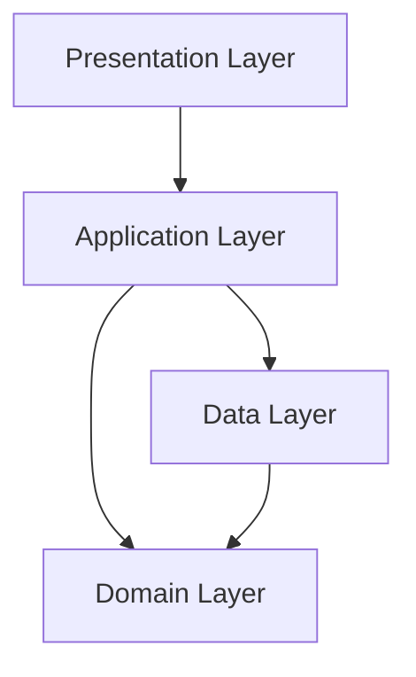
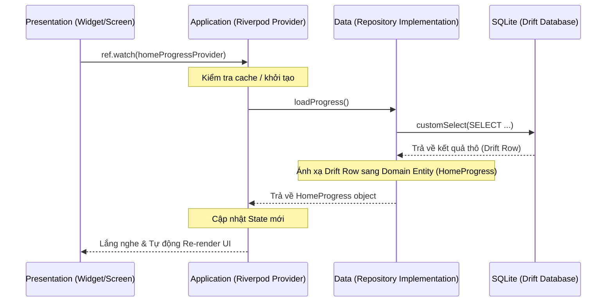

# Kiến trúc Phân lớp (Layered Architecture) - Zen Japanese Mobile

Tài liệu này mô tả chi tiết kiến trúc phân lớp theo hướng **Feature-first Clean Architecture** được áp dụng trong mã nguồn của Zen Japanese Mobile. Mục tiêu là phân định rõ ràng ranh giới trách nhiệm giữa các phần trong code, giảm thiểu sự phụ thuộc lẫn nhau (coupling), và tạo điều kiện thuận lợi cho việc kiểm thử (testing) cũng như mở rộng tính năng mới.

---

## 1. Tổng quan Kiến trúc

Dự án áp dụng mô hình Clean Architecture được chia nhỏ theo từng Tính năng (Feature-first). Thay vì gom tất cả Repository vào một thư mục chung hoặc tất cả Widget vào một thư mục UI lớn, chúng ta chia mã nguồn thành các module độc lập theo nghiệp vụ (ví dụ: `home`, `review`, `garden`, `learning`, v.v.).

Mỗi Feature được chia thành tối đa 4 tầng con:
```text
features/<feature_name>/
  ├── domain/        (Nghiệp vụ cốt lõi, độc lập hoàn toàn với UI & Framework)
  ├── application/   (Quản lý trạng thái, điều phối luồng dữ liệu - Riverpod)
  ├── data/          (Hiện thực hóa việc lưu trữ, truy cập SQLite/Firebase/API)
  └── presentation/  (Giao diện người dùng - Flutter Widgets, Screens, Painters)
```

Sơ đồ quan hệ phụ thuộc giữa các tầng:



> [!IMPORTANT]
> **Quy tắc phụ thuộc cốt lõi (Dependency Rule):** 
> Các tầng vòng ngoài chỉ được phép phụ thuộc vào các tầng vòng trong. **Tầng Domain là trung tâm và KHÔNG được phép phụ thuộc vào bất kỳ tầng nào khác.** Tầng Domain cũng không được phép import các thư viện liên quan đến Flutter UI hoặc Riverpod.

---

## 2. Chi tiết các Tầng trong Feature

### 2.1. Tầng Domain (Domain Layer)
Tầng Domain chứa toàn bộ logic nghiệp vụ (business logic) và các quy tắc nghiệp vụ cốt lõi của tính năng. Nó là phần thuần túy nhất của ứng dụng.

- **Nhiệm vụ:**
  - Định nghĩa các thực thể dữ liệu nghiệp vụ (**Entities**).
  - Khai báo các hợp đồng giao tiếp dữ liệu (**Repository Contracts** / Interfaces).
  - Chứa các dịch vụ nghiệp vụ thuần túy (**Domain Services**) nếu cần xử lý các logic phức tạp vượt ngoài phạm vi của một Entity đơn lẻ.
- **Quy tắc:**
  - Chỉ sử dụng các thư viện Dart thuần túy.
  - **KHÔNG** import `package:flutter/...` (không phụ thuộc vào UI framework).
  - **KHÔNG** import các package quản lý trạng thái như `flutter_riverpod` hay các công cụ lưu trữ như `drift`.
  - Chỉ định nghĩa *Interface* của Repository dưới dạng lớp trừu tượng (`abstract class`), không viết phần thân code truy vấn cơ sở dữ liệu ở đây.

*Ví dụ về Repository Contract trong* [home_progress_repository.dart](file:///d:/Code/Project/mobile/lib/features/home/domain/repositories/home_progress_repository.dart):
```dart
import 'package:mobile/core/models/progress_models.dart';

abstract class HomeProgressRepository {
  Future<HomeProgress> loadProgress();
}
```

---

### 2.2. Tầng Application (Application Layer)
Tầng Application đóng vai trò là cầu nối giữa Tầng Domain và Tầng Presentation. Nó chịu trách nhiệm quản lý trạng thái (State Management) và điều phối các ca sử dụng (Use Cases).

- **Nhiệm vụ:**
  - Quản lý trạng thái hiển thị của UI thông qua các State, Notifier, hoặc Controller.
  - Cung cấp các **Riverpod Providers** để Tầng Presentation có thể dễ dàng lắng nghe và cập nhật dữ liệu.
  - Đóng gói logic điều phối hành động (ví dụ: khi người dùng nhấn nút "Học xong", tầng này sẽ gọi Repository để lưu dữ liệu, sau đó thông báo cho UI cập nhật trạng thái mới).
- **Quy tắc:**
  - Phụ thuộc vào Tầng Domain và Tầng Data (thông qua interface/contract).
  - Sử dụng Riverpod làm công cụ chính để phân phát trạng thái (`NotifierProvider`, `FutureProvider`, `StateNotifierProvider`...).
  - Không chứa trực tiếp mã nguồn giao diện (Widget, BuildContext).

*Ví dụ về Provider trong* [home_progress_provider.dart](file:///d:/Code/Project/mobile/lib/features/home/application/providers/home_progress_provider.dart):
```dart
import 'package:flutter_riverpod/flutter_riverpod.dart';
import 'package:mobile/app/bootstrap/database_initializer_provider.dart';
import 'package:mobile/core/models/progress_models.dart';
import 'package:mobile/features/home/domain/repositories/home_progress_repository.dart';

// Provider định nghĩa interface của Repository
final homeProgressRepositoryProvider = Provider<HomeProgressRepository>((ref) {
  throw UnimplementedError('homeProgressRepositoryProvider must be overridden');
});

// FutureProvider chịu trách nhiệm tải dữ liệu tiến trình học tập
final homeProgressProvider = FutureProvider<HomeProgress>((ref) async {
  await ref.watch(databaseInitializerProvider.future);
  return ref.watch(homeProgressRepositoryProvider).loadProgress();
});
```

---

### 2.3. Tầng Data (Data Layer)
Tầng Data chịu trách nhiệm hiện thực hóa (implement) các Repository Contract đã được định nghĩa ở Tầng Domain. Nó xử lý việc đọc/ghi dữ liệu từ các nguồn thực tế (Database, Cache, Cloud API...).

- **Nhiệm vụ:**
  - Thực hiện các truy vấn SQLite thông qua Drift ORM.
  - Tương tác với dịch vụ đám mây Firebase Authentication để quản lý phiên đăng nhập.
  - Đọc/ghi cấu hình người dùng thông qua SharedPreferences.
  - Đọc và phân tách dữ liệu bài học được đóng gói sẵn trong Assets.
- **Quy tắc:**
  - Phụ thuộc trực tiếp vào Tầng Domain (để triển khai các Repository interface).
  - Chuyển đổi các Model lưu trữ (Drift Table Row, JSON từ API) sang Domain Entities trước khi trả dữ liệu về tầng trên.

*Ví dụ về Implementation trong* [drift_home_progress_repository.dart](file:///d:/Code/Project/mobile/lib/features/home/data/repositories/drift_home_progress_repository.dart):
```dart
import 'package:mobile/core/models/progress_models.dart';
import 'package:mobile/data/datasources/app_database.dart';
import 'package:mobile/features/home/domain/repositories/home_progress_repository.dart';

class DriftHomeProgressRepository implements HomeProgressRepository {
  final AppDatabase _db;

  const DriftHomeProgressRepository(this._db);

  @override
  Future<HomeProgress> loadProgress() async {
    // Truy vấn dữ liệu thực tế từ Drift SQLite qua SQL hoặc Fluent API
    final row = await _db.customSelect(...).getSingle();
    
    // Ánh xạ (map) kết quả truy vấn thành một Domain Entity (HomeProgress)
    return HomeProgress(
      kanji: ModuleProgress(...),
      vocabulary: ModuleProgress(...),
      grammar: ModuleProgress(...),
      // ...
    );
  }
}
```

---

### 2.4. Tầng Presentation (Presentation Layer)
Tầng Presentation chịu trách nhiệm hiển thị giao diện người dùng và nhận các tương tác đầu vào từ người học.

- **Nhiệm vụ:**
  - Vẽ giao diện bằng các Flutter Widgets (`StatelessWidget`, `ConsumerStatefulWidget`...).
  - Thiết kế hiệu ứng, chuyển động hoạt họa (Animations), và các tương tác vẽ tay tùy chỉnh (Custom Painters).
  - Định cấu hình và xử lý các sự kiện điều hướng màn hình thông qua [AppRoutes](file:///d:/Code/Project/mobile/lib/presentation/navigation/app_routes.dart).
- **Quy tắc:**
  - **Chỉ tập trung vào giao diện:** Không viết logic tính toán nghiệp vụ phức tạp hoặc truy cập database trực tiếp tại đây.
  - Sử dụng `ref.watch()` để lắng nghe sự thay đổi trạng thái từ Application layer và tự động kết xuất lại (re-render).
  - Gửi các sự kiện (actions) của người dùng đến Notifier/Controller ở tầng Application bằng cách gọi `ref.read(someProvider.notifier).action()`.

---

## 3. Các thành phần Core và App dùng chung

Ngoài cấu trúc thư mục phân theo Feature, dự án có hai thư mục dùng chung quan trọng:

### 3.1. Thư mục `lib/core`
Chứa các thành phần hạ tầng cốt lõi được tái sử dụng xuyên suốt dự án. `core` **không** được phép phụ thuộc vào các thư mục `features/` cụ thể.
- **`core/srs/`**: Thuật toán tính toán chu kỳ lặp lại ngắt quãng (FSRS-lite) độc lập giúp xác định ngày ôn tập tiếp theo dựa trên phản hồi của người dùng.
- **`core/services/`**: Các service cục bộ của thiết bị như nhận dạng nét vẽ tay bằng ML Kit, tổng hợp giọng nói phát âm (TTS), đặt lịch và gửi thông báo ôn tập (Notifications).
- **`core/theme/`**: Định nghĩa hệ thống màu sắc, kiểu chữ và cấu hình giao diện chung của ứng dụng.

### 3.2. Thư mục `lib/app` (Composition Root)
Nơi khởi tạo và lắp ráp (wire) toàn bộ ứng dụng. Đây là điểm duy nhất được phép biết về tất cả các feature và liên kết interface với implementation tương ứng.
- **[repository_overrides.dart](file:///d:/Code/Project/mobile/lib/app/composition/repository_overrides.dart)**: Nơi cấu hình Dependency Injection chính của dự án thông qua cơ chế ghi đè của Riverpod (`ProviderScope overrides`). Tại đây, các Repository interface trừu tượng ở tầng Domain sẽ được trỏ đến các lớp hiện thực cụ thể ở tầng Data (ví dụ: Ghi đè `homeProgressRepositoryProvider` bằng `DriftHomeProgressRepository`).

---

## 4. Luồng đi của Dữ liệu (Data Flow)

Để đảm bảo tính nhất quán, dữ liệu trong ứng dụng di chuyển theo một luồng đơn hướng (Unidirectional Data Flow):



Khi người dùng thực hiện một hành động ghi (ví dụ: hoàn thành một bài ôn tập):
1. **Presentation:** Nhận sự kiện chạm (tương tác vẽ chữ) -> Gọi hàm lưu kết quả: `ref.read(reviewControllerProvider.notifier).submitReview(item, rating)`.
2. **Application (Controller):** Nhận yêu cầu -> Gọi hàm ghi nhận của Data Repository: `ref.read(reviewRepositoryProvider).saveReviewResult(...)`.
3. **Data:** Lưu dữ liệu mới xuống SQLite Drift Database -> Cập nhật các bảng liên quan (`ReviewLogTable`, `StudyLogTable`).
4. **Application (Controller):** Sau khi ghi dữ liệu thành công -> Gọi `ref.invalidate(homeProgressProvider)` để làm mới dữ liệu trang chủ hoặc tự động cập nhật state.
5. **Presentation:** Tự động lắng nghe sự thay đổi của `homeProgressProvider` và vẽ lại giao diện Dashboard mới với điểm EXP và chuỗi ngày học được cập nhật.

---

## 5. Hướng dẫn thêm một Tính năng mới (Developer Onboarding)

Khi bạn cần thêm một tính năng mới (ví dụ: Luyện viết câu - Sentence Practice):

### Bước 1: Định nghĩa Domain Entity và Repository Contract
Tạo các model nghiệp vụ thuần Dart trong thư mục `domain/` của feature.

*File: `lib/features/sentence/domain/entities/sentence.dart`*
```dart
class Sentence {
  final int id;
  final String Japanese;
  final String translation;

  const Sentence({required this.id, required this.Japanese, required this.translation});
}
```

*File: `lib/features/sentence/domain/repositories/sentence_repository.dart`*
```dart
import '../entities/sentence.dart';

abstract class SentenceRepository {
  Future<List<Sentence>> getSentencesForGrammar(int grammarId);
}
```

### Bước 2: Hiện thực hóa Repository ở tầng Data
Tạo lớp hiện thực (implementation) truy vấn cơ sở dữ liệu thực tế.

*File: `lib/features/sentence/data/repositories/sentence_repository_impl.dart`*
```dart
import 'package:mobile/data/datasources/app_database.dart';
import '../../domain/entities/sentence.dart';
import '../../domain/repositories/sentence_repository.dart';

class SentenceRepositoryImpl implements SentenceRepository {
  final AppDatabase _db;

  const SentenceRepositoryImpl(this._db);

  @override
  Future<List<Sentence>> getSentencesForGrammar(int grammarId) async {
    // Viết logic truy vấn bằng Drift...
  }
}
```

### Bước 3: Tạo Application Provider
Định nghĩa provider đại diện cho interface và provider quản lý trạng thái.

*File: `lib/features/sentence/application/providers/sentence_provider.dart`*
```dart
import 'package:flutter_riverpod/flutter_riverpod.dart';
import '../../domain/repositories/sentence_repository.dart';

final sentenceRepositoryProvider = Provider<SentenceRepository>((ref) {
  throw UnimplementedError('sentenceRepositoryProvider must be overridden');
});

final sentencesProvider = FutureProvider.family<List<Sentence>, int>((ref, grammarId) {
  return ref.watch(sentenceRepositoryProvider).getSentencesForGrammar(grammarId);
});
```

### Bước 4: Đăng ký ghi đè tại Composition Root
Ánh xạ interface sang implementation thực tế để ứng dụng có thể khởi tạo chính xác.

*File:* [repository_overrides.dart](file:///d:/Code/Project/mobile/lib/app/composition/repository_overrides.dart)
```dart
// Thêm override cho repository mới vào danh sách appRepositoryOverrides:
sentenceRepositoryProvider.overrideWith(
  (ref) => SentenceRepositoryImpl(ref.watch(databaseProvider)),
),
```

### Bước 5: Viết giao diện ở tầng Presentation
Xây dựng UI Widget/Screen lắng nghe dữ liệu từ các provider đã tạo và gắn route điều hướng.

*File: `lib/features/sentence/presentation/screens/sentence_practice_screen.dart`*
```dart
import 'package:flutter/material.dart';
import 'package:flutter_riverpod/flutter_riverpod.dart';
import '../../application/providers/sentence_provider.dart';

class SentencePracticeScreen extends ConsumerWidget {
  final int grammarId;
  const SentencePracticeScreen({super.key, required this.grammarId});

  @override
  Widget build(BuildContext context, WidgetRef ref) {
    final sentencesAsync = ref.watch(sentencesProvider(grammarId));
    return sentencesAsync.when(
      data: (sentences) => ListView.builder(
        itemCount: sentences.length,
        itemBuilder: (_, index) => Text(sentences[index].Japanese),
      ),
      loading: () => const CircularProgressIndicator(),
      error: (err, _) => Text('Lỗi: $err'),
    );
  }
}
```
 Gắn route điều hướng trong [AppRoutes](file:///d:/Code/Project/mobile/lib/presentation/navigation/app_routes.dart) để các màn hình khác dễ dàng di chuyển tới màn hình mới.
