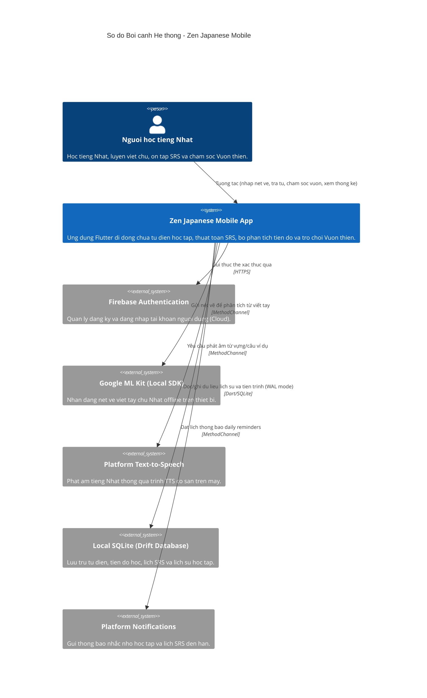

# Tài liệu Bối cảnh Hệ thống - Zen Japanese Mobile

## Tổng quan Hệ thống (System Overview)

### Mô tả ngắn (Short Description)
Zen Japanese Mobile là một ứng dụng di động phát triển bằng Flutter dành cho việc học tiếng Nhật, kết hợp giữa từ điển JLPT, hệ thống lặp lại ngắt quãng (SRS) tùy chỉnh, nhận dạng chữ viết tay, theo dõi lộ trình học tập, phân tích tiến độ và vòng lặp phần thưởng trò chơi hóa "Vườn thiền" (Zen Garden).

### Mô tả chi tiết (Long Description)
Zen Japanese Mobile là một ứng dụng di động hoạt động theo cơ chế ưu tiên ngoại tuyến (offline-first), mang lại trải nghiệm học tiếng Nhật toàn diện, thú vị và có cấu trúc rõ ràng. Hệ thống hướng tới các cấp độ JLPT từ N5 đến N1, cung cấp các từ điển chuyên biệt và các mô-đun dành cho Hán tự (Kanji), Từ vựng (Vocabulary) và Ngữ pháp (Grammar).

Để đảm bảo khả năng ghi nhớ dài hạn, ứng dụng tích hợp một Hệ thống lặp lại ngắt quãng (SRS) tùy chỉnh, tự động cập nhật trạng thái thẻ dựa trên phản hồi của người dùng và tính toán lịch trình ôn tập ngay trên thiết bị thông qua cơ sở dữ liệu Drift SQLite. Một điểm nhấn quan trọng là bảng vẽ tay tích hợp công nghệ nhận dạng ký tự cục bộ của Google ML Kit Digital Ink Recognition, giúp người học luyện viết chữ Hán và Kana trực quan.

Bên cạnh đó, để tạo động lực học tập, ứng dụng triển khai cơ chế phần thưởng Vườn thiền (Zen Garden). Khi hoàn thành bài học, bài kiểm tra và các phiên ôn tập SRS, người dùng sẽ nhận được các tài nguyên ảo (nước, ánh sáng mặt trời, điểm kinh nghiệm) để mua sắm và chăm sóc cây cảnh trong vườn thiền cá nhân của mình. Bảng phân tích cung cấp các biểu đồ tiến độ trực quan (chuỗi ngày học, bản đồ nhiệt heatmap, tỷ lệ hoàn thành lộ trình học và phân tích điểm yếu) được tổng hợp hoàn toàn từ dữ liệu học tập nội bộ.

---

## Đối tượng người dùng (Personas)

### Người học tiếng Nhật (Tác nhân chính)
- **Loại**: Người dùng thực tế (Human User)
- **Mô tả**: Những cá nhân đang tự học tiếng Nhật (ôn thi các cấp độ JLPT N5-N1 hoặc học giao tiếp, nâng cao kỹ năng ngôn ngữ).
- **Mục tiêu**:
  - Học các kiến thức tiếng Nhật mới (từ vựng, chữ Hán, ngữ pháp) một cách có lộ trình bài bản.
  - Ôn tập các mục đã học bằng cách thực hành viết tay kết hợp thuật toán SRS để chống quên.
  - Theo dõi sát sao tiến trình học (chuỗi ngày liên tục, tỷ lệ duy trì, điểm yếu) để giữ kỷ luật.
  - Xây dựng và trang trí Vườn thiền ảo như một hình ảnh trực quan thể hiện sự bền bỉ của bản thân.
- **Tính năng chính sử dụng**: Lộ trình học, Bảng vẽ ôn tập SRS, Tra từ điển Hán tự/Từ vựng/Ngữ pháp, Cửa hàng & Vườn thiền Zen Garden, Bản đồ nhiệt tiến độ, Cài đặt ứng dụng.

---

## Các tính năng hệ thống (System Features)

### Xác thực & Hồ sơ cá nhân
- **Mô tả**: Quản lý tài khoản đăng nhập, đăng ký và trạng thái phiên làm việc của người dùng.
- **Người dùng**: Người học tiếng Nhật
- **Hành trình**: [Hành trình Xác thực của Người học](#hành-trình-xác-thực-của-người-học)

### Lộ trình học tập (Learning Path)
- **Mô tả**: Cung cấp lộ trình học theo từng cấp độ, hướng dẫn người dùng qua các bài học từ vựng, ngữ pháp và chữ Hán, kèm theo bài kiểm tra đánh giá.
- **Người dùng**: Người học tiếng Nhật
- **Hành trình**: [Hành trình Học tập bài mới](#hành-trình-học-tập-bài-mới)

### Ôn tập SRS với Bảng vẽ tay
- **Mô tả**: Giao diện ôn tập tương tác nơi người dùng viết ký tự lên màn hình vẽ. Mô hình AI cục bộ sẽ phân tích nét vẽ để chấm điểm đúng/sai, cập nhật trạng thái bộ nhớ SRS (độ ổn định, độ khó) vào cơ sở dữ liệu.
- **Người dùng**: Người học tiếng Nhật
- **Hành trình**: [Hành trình Ôn tập SRS](#hành-trình-ôn-tập-srs)

### Vườn thiền Zen Garden (Vòng lặp phần thưởng)
- **Mô tả**: Hệ thống trò chơi hóa nơi người dùng thu thập nước, ánh sáng và điểm kinh nghiệm thông qua học tập để mua sắm hạt giống, cây cảnh và nuôi dưỡng chúng phát triển trong vườn.
- **Người dùng**: Người học tiếng Nhật
- **Hành trình**: [Hành trình Chăm sóc Vườn thiền](#hành-trình-chăm-sóc-vườn-thiền)

### Từ điển Hán tự & Từ vựng
- **Mô tả**: Cho phép tìm kiếm nhanh nghĩa, âm đọc Furigana, ví dụ minh họa, bộ thủ chữ Hán, ảnh động thứ tự nét viết và phát âm từ vựng.
- **Người dùng**: Người học tiếng Nhật
- **Hành trình**: [Hành trình Tra cứu từ điển](#hành-trình-tra-cứu-từ-điển)

### Bảng phân tích tiến độ học tập (Study Analytics)
- **Mô tả**: Hiển thị các chỉ số học tập, chuỗi ngày học liên tiếp, biểu đồ heatmap 105 ngày hoạt động, thống kê tỉ lệ duy trì và đưa ra gợi ý về phần kiến thức yếu nhất.
- **Người dùng**: Người học tiếng Nhật
- **Hành trình**: [Hành trình Xem phân tích tiến độ](#hành-trình-xem-phân-tích-tiến-độ)

---

## Hành trình người dùng (User Journeys)

### Hành trình Xác thực của Người học
1. **Chào mừng**: Người dùng mở ứng dụng và dừng ở màn hình Đăng nhập/Chào mừng.
2. **Chọn phương thức**: Người dùng chọn đăng nhập bằng Google, Email/Mật khẩu hoặc dùng thử Ẩn danh (Anonymous).
3. **Xác thực**: Ứng dụng gửi yêu cầu xác thực tới dịch vụ Cloud Firebase Authentication.
4. **Khởi tạo dữ liệu**: Khi thành công, Firebase trả về định danh người dùng, cơ sở dữ liệu nội bộ được đồng bộ/thiết lập và người dùng được chuyển hướng vào Dashboard chính.

### Hành trình Học tập bài mới
1. **Lựa chọn**: Người dùng điều hướng tới tab Lộ trình học và chọn một bài học đã được mở khóa (Ví dụ: Từ vựng N5).
2. **Nạp kiến thức**: Người dùng đọc mẹo nhớ chữ Hán, luyện đọc từ vựng và xem các câu ví dụ đi kèm.
3. **Kiểm tra**: Người dùng hoàn thành bài trắc nghiệm ngắn ở cuối bài học.
4. **Nhận thưởng**: Ứng dụng lưu trạng thái hoàn thành vào bảng `LessonTable` của database và cộng thêm nước, ánh sáng mặt trời cho người dùng.

### Hành trình Ôn tập SRS
1. **Kích hoạt**: Người dùng xem số lượng thẻ cần ôn tập trên Dashboard và bắt đầu phiên ôn tập SRS.
2. **Luyện viết tay**: Với mỗi từ/chữ Hán hiện ra, người dùng vẽ ký tự lên canvas vẽ tay.
3. **Nhận dạng**: Mô hình nhận dạng chữ viết tay chạy local phân tích nét vẽ để đề xuất kết quả so khớp.
4. **Đánh giá & Lưu trữ**: Người dùng tự đánh giá mức độ nhớ của mình, cơ sở dữ liệu Drift SQLite cập nhật thông tin thẻ và tự động dời lịch ôn tập tiếp theo (`next_review`).
5. **Tích lũy tài nguyên**: Sau khi hoàn thành hết các thẻ cần ôn, người dùng nhận tài nguyên vườn thiền và EXP.

### Hành trình Chăm sóc Vườn thiền
1. **Xem vườn**: Người dùng mở tab Zen Garden để kiểm tra bố cục vườn, số lượng cây cảnh hiện có và số lượng tài nguyên đang sở hữu.
2. **Mua sắm**: Người dùng vào Cửa hàng (Shop), sử dụng nước và ánh sáng mặt trời tích lũy được để mua thêm cây cảnh mới (cây bonsai, tre...).
3. **Nuôi dưỡng**: Người dùng đặt cây vào ô trống trên lưới sân vườn và tiến hành tưới nước, nhận điểm EXP để nâng cấp cấp độ Vườn thiền.

### Hành trình Tra cứu từ điển
1. **Tìm kiếm**: Người dùng nhập từ khóa (nghĩa tiếng Việt/tiếng Anh, Hiragana hoặc Kanji) vào thanh tìm kiếm toàn cục.
2. **Truy vấn**: Cơ sở dữ liệu sử dụng bảng ảo FTS5 SQLite thực hiện truy vấn văn bản đầy đủ tốc độ cao.
3. **Chi tiết**: Người dùng chọn mục Hán tự để xem số nét vẽ, bộ thủ, các từ liên quan và có thể luyện vẽ nét trực tiếp.
4. **Phát âm**: Người dùng bấm vào biểu tượng Loa để nghe phát âm mẫu thông qua công cụ Text-To-Speech (TTS) của thiết bị.

### Hành trình Xem phân tích tiến độ
1. **Truy cập**: Người dùng mở màn hình Thống kê (Analytics).
2. **Tổng hợp**: Ứng dụng tổng hợp các bản ghi lịch sử từ bảng `StudyLogTable` và `ReviewLogTable` lưu trong máy.
3. **Trực quan hóa**: Màn hình kết xuất bản đồ nhiệt (heatmap) 105 ngày gần nhất, phần trăm hoàn thành các cấp độ JLPT và biểu đồ tiến độ học tập.
4. **Định hướng**: Người dùng quan sát "Vùng kiến thức yếu nhất" (Weakest Area) được hệ thống chỉ ra để lên kế hoạch tự ôn tập thêm.

---

## Các hệ thống bên ngoài và phụ thuộc (External Systems and Dependencies)

### Firebase Authentication (Cloud)
- **Loại**: Dịch vụ xác thực danh tính đám mây (Cloud Service)
- **Mô tả**: Dịch vụ của Google để lưu trữ và quản lý tài khoản người dùng một cách bảo mật.
- **Tích hợp**: HTTPS kết nối qua Firebase Core & Auth SDK.
- **Mục đích**: Hỗ trợ người dùng đăng nhập bằng Google hoặc Email/Mật khẩu và duy trì trạng thái đăng nhập đồng nhất.

### Google ML Kit Digital Ink Recognition (Local SDK)
- **Loại**: Thư viện Trí tuệ nhân tạo chạy trên thiết bị (Local SDK)
- **Mô tả**: API nhận dạng nét vẽ viết tay của Google chạy trực tiếp offline trên thiết bị.
- **Tích hợp**: Giao tiếp thông qua MethodChannels của Flutter.
- **Mục đích**: Tự động tải xuống mô hình ngôn ngữ tiếng Nhật (`ja`) khi cài đặt ban đầu, nhận dạng chữ viết tay của người dùng trực tiếp trên máy mà không cần gửi dữ liệu lên máy chủ.

### Platform Text-to-Speech (Local SDK)
- **Loại**: Công cụ tổng hợp giọng nói của hệ điều hành (Android / iOS SDK)
- **Mô tả**: Sử dụng trình TTS mặc định được cài đặt trên điện thoại của người học.
- **Tích hợp**: Giao tiếp thông qua gói `flutter_tts` (MethodChannel).
- **Mục đích**: Chuyển các câu ví dụ và từ vựng tiếng Nhật thành giọng nói tự nhiên để người dùng luyện nghe.

### Platform Local Notifications (Local SDK)
- **Loại**: Dịch vụ quản lý thông báo hệ điều hành (Local SDK)
- **Mô tả**: Công cụ đặt lịch và hiển thị thông báo trên thiết bị di động.
- **Tích hợp**: Sử dụng gói `flutter_local_notifications` kết hợp với cấu hình múi giờ `timezone`.
- **Mục đích**: Nhắc nhở người học ôn tập hàng ngày đúng giờ hoặc cảnh báo khi có thẻ SRS đến hạn ôn tập kể cả khi ứng dụng đang đóng.

### Cơ sở dữ liệu nội bộ thiết bị (Drift SQLite)
- **Loại**: Cơ sở dữ liệu SQL cục bộ (Local Storage)
- **Mô tả**: Database SQLite cục bộ được quản lý thông qua Drift ORM.
- **Tích hợp**: Drift C-binding và sqlite3 native engine.
- **Mục đích**: Đảm bảo ứng dụng chạy mượt mà ngoại tuyến, lưu trữ toàn bộ kho dữ liệu học JLPT, ghi lại lịch sử ôn tập, trạng thái vườn thiền và cấu hình hệ thống một cách tối ưu bằng cơ chế ghi nhật ký trước (WAL - Write-Ahead Logging).

---

## Sơ đồ Bối cảnh Hệ thống (System Context Diagram)

---

## Tài liệu liên quan (Related Documentation)

- [Bản đồ cấu trúc dự án](file:///d:/Code/Project/mobile/docs/project_structure.md): Tài liệu mô tả cách phân chia thư mục, Clean Architecture trong `lib/` và nhiệm vụ của từng tầng code.
- [Kiến trúc Phân lớp](file:///d:/Code/Project/mobile/docs/layered_architecture.md): Tài liệu chi tiết mô tả ranh giới giữa các tầng Domain, Application, Data, Presentation và quy tắc phụ thuộc.
